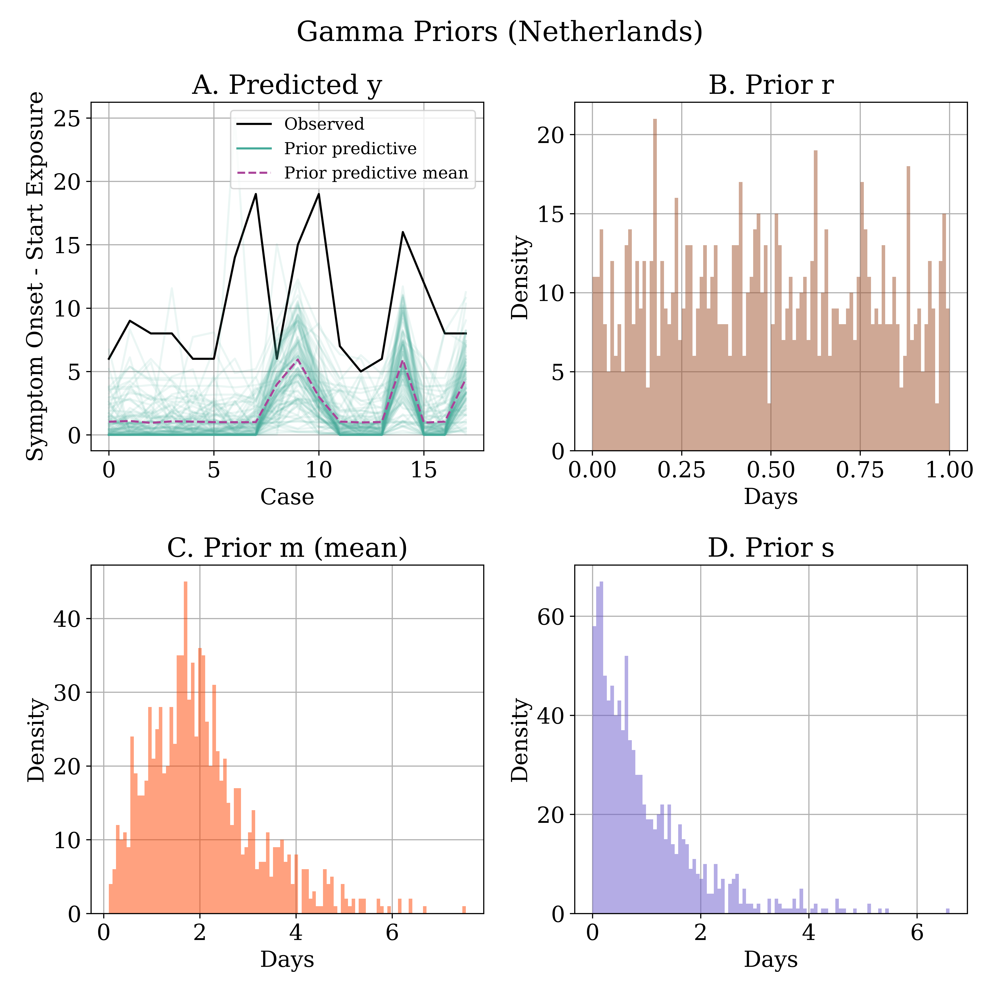
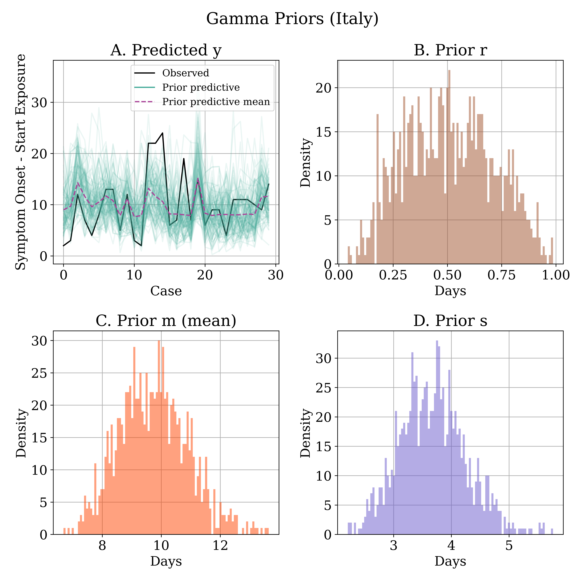
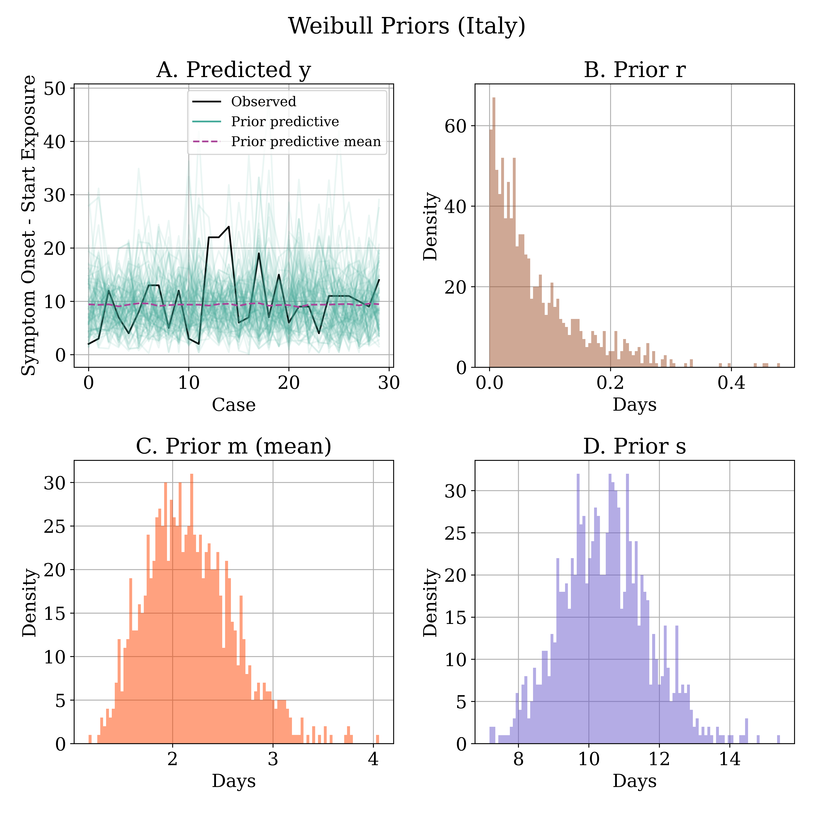
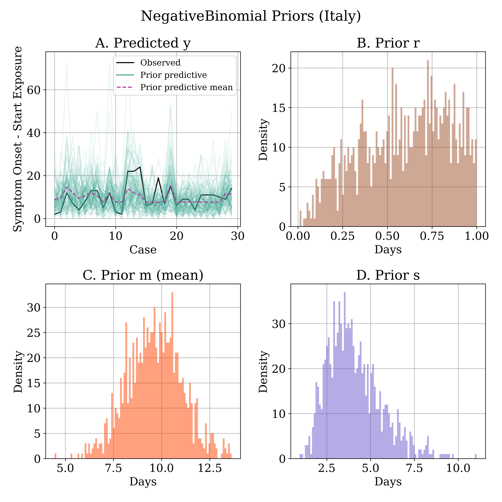
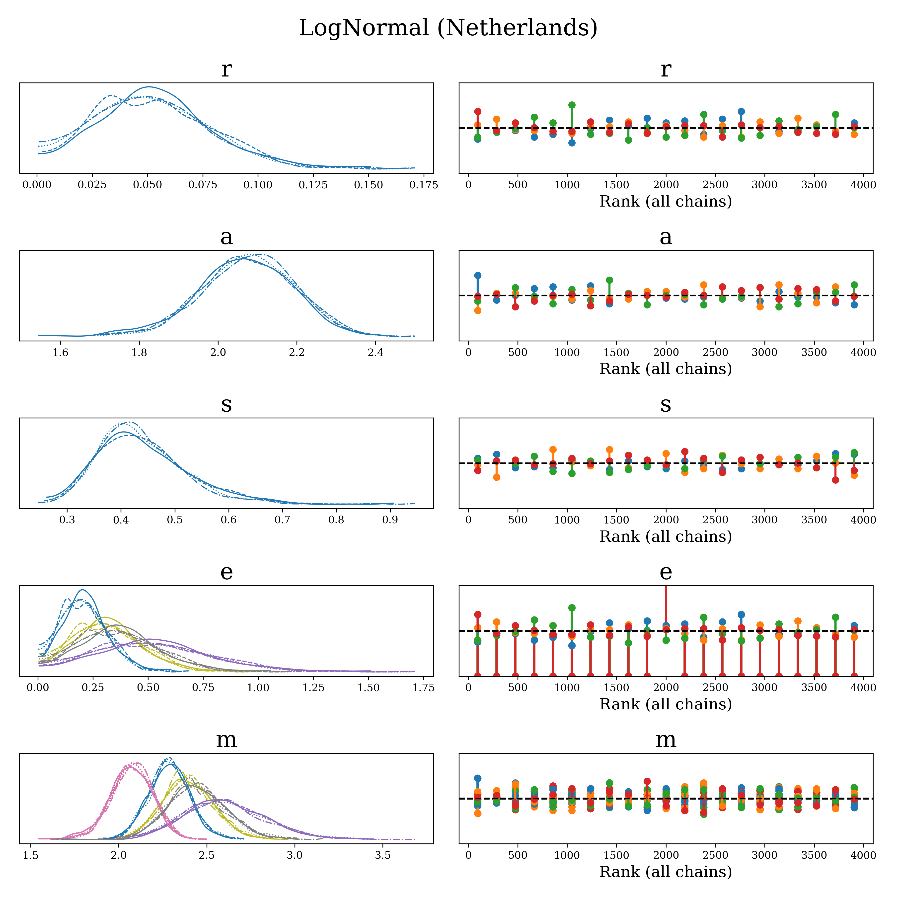
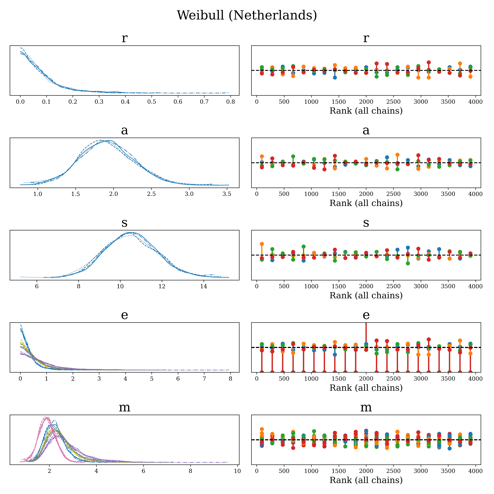
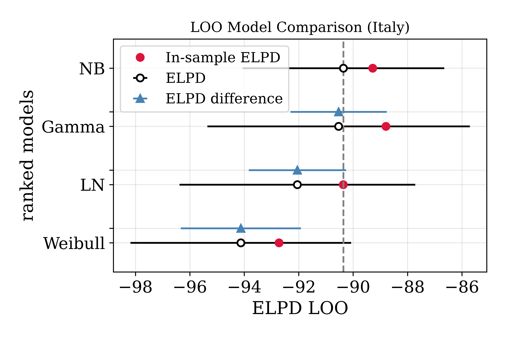

<h1> Mpox Incubation Estimation (Bayesian Workflow) </h1>

The present repository reproduces and expands the analyses carried on by Miura and colleagues (2022) [see : https://github.com/fmiura/MpxInc_2022/tree/main]. We expand the analyses by providing fully parametrised models obtaining very close results to Miura et al. (2022). we also provide an example of prior updating where we fit models to data from Italy by adjusting priors based on the Netherlands models posteriors. 

<h1> Models </h1>

 We implement the three models used in previous analyses: Lognormal, Gamma and Weibull models, and we add a NegativeBinomial model. All models use the same priors for parameters, with the exception of the sampling distribution (likelihood): 

<i>

 r ~ Beta(1, 1) 

 a ~ Gamma(1, 1) 

 m = a + e 

 s ~ Gamma(1, 1) 

 e = r(E - S) 

 y ~ LogNormal(&mu;=m, &sigma;=s) 

</i>

 Where, E is a vector containing the end of the exposure period, S is a vector containing the beginning of exposure period, <i>r</i> is the exposure period rate, and the observed data for <i>y</i> corresponds to the onset of symptoms vector O - S. The model above is repeated three more times but replacing <i>y</i> with <i>y</i> ~ Gamma(&mu;=m, &sigma;=s), parametrised via mean &mu; and standard deviation &sigma;;  <i>y</i> ~ Weibull(&alpha;=m, &beta;=s) with shape &alpha; and scale &beta;, and <i>y</i> ~ NegativeBinomial(&mu;=m, &alpha;=s) with mean &mu; and shape &sigma;. 

<h1> Prior Predictive Checks </h1>

 The defined generic and lowly informative priors may be problematic for some models, as they may not provide good coverage for the observed data ranges or maybe they will cover unrealistic values. Prior predictives for the Netherlands data indicate that LogNormal and Weibull distributions provide very extreme values and Gamma and NegativeBinomial distributions provide more reasonable coverage, but with shifted locations (towards 0). It is probable that posterior distributions will adapt to more realistic values, as prior distributions themselves show very reasonable values within the expected day-range (i.e. up to around 10 days).

	
	

	
	

 Prior predictives for the Italy data show a very similar pattern when no prior update is performed (see prior_predictive directory). However, when posterior information from the Netherlands models is included, prior predictive distributions improve substantially. 

	
	

	
	

<h1> Sampling </h1>

 Models sampled with NUTS HMC with 1000 tuning steps and 1000 samples over 4 chains. Models sampled well with all R_hats = 1, and ESS > 1000, and BFMIs > 0.9. Rankplots below confirm good convergence from the Netherlands models, models for Italy show similar outputs (see convergence_checks directory). 

	
	

	
	

<h1> Posterior Assessment </h1>

The estimated mean incubation periods from the Netherlands data reproduce previous results closely, as Table 1 shows. Posterior distributions CDF plots indicate similarity of results, with some additional variation expected from a fully parametrised model. There is a small difference in the LogNormal estimated mean (9.88), which may be explained by the inclusion of the exposure period in the computation of the incubation period mean.

	

	

 When using the default Beta and Gamma priors, the models applied to Italy's data show similar results as the previous analysis, with mean incubation periods estimated to be between 9 and 10 days. 

	

	

 After this, we used the posterior mean and standard from <i>r</i>, <i>a</i> and <i>s</i> parameters from the Netherlands model and used it to parameterise the respective priors in the Italy model. (See posteriors directory for posteriors.csv files containing posterior summaries and convergence statistics). Results showed slightly improved precision.   

	

	

<h1> Posterior Predictive Checks </h1>

 Posterior predictive distributions indicate good performance of models, with a good measurement of uncertainty around the predicted mean and observed data, in particular from  Gamma and NegativeBinomial models.

	

	

<h1> Model Comparison </h1>

 As expected from small data models, updating priors changes the predictive capacity of models, though it is relevant to emphasise that models show high overlap in their expected log-predictive densities (ELPDs). Italy models indicate that Gamma and NegativeBinomial distributions outperform the other two distributions, in particular when using more informative priors. Note that in this case, the PSIS-LOO comparison indicates that Gamma and NegativeBinomial models have very similar weights of 47% and 53% respectively (see model_comaprison directory). 

	

	

	

<h1> Conclusion </h1>

 Results indicate that prior updating on models applied to new data (excluding previous data) can aid the estimation process. However, more testing is needed to asses what are the concrete advantages. Present analyses attempted to reproduce and expand previous results (Miura et al. 2022), but important parts of the analysis process need to be included. A prior sensitivity analysis may be required, as models are very sensitive to prior variation. Also, more technical and theoretical considerations could be included, such as the more appropriate use of Gamma distributions for measuring elapsed times or the NegativeBinomial for assessing count data (i.e. number of days between one event and the next). This could also imply that model averaging between the models using the most appropriate sampling distributions (not necessarily the best ones at prediction) should also be considered. 

<h1> References </h1>

 Miura Fuminari, van Ewijk Catharina E, Backer Jantien A, Xiridou Maria, Franz Eelco, Op de Coul Eline, Brandwagt Diederik, van Cleef Brigitte, van Rijckevorsel Gini, Swaan Corien, van den Hof Susan, Wallinga Jacco. Estimated incubation period for monkeypox cases confirmed in the Netherlands, May 2022. Euro Surveill. 2022;27(24):pii=2200448. https://doi.org/10.2807/1560-7917.ES.2022.27.24.2200448

<h1> License </h1>
<h4>MIT License</h4>

Copyright (c) 2023 Kraemer Lab, University of Oxford

Permission is hereby granted, free of charge, to any person obtaining a copy
of this software and associated documentation files (the "Software"), to deal
in the Software without restriction, including without limitation the rights
to use, copy, modify, merge, publish, distribute, sublicense, and/or sell
copies of the Software, and to permit persons to whom the Software is
furnished to do so, subject to the following conditions:

The above copyright notice and this permission notice shall be included in all
copies or substantial portions of the Software.

THE SOFTWARE IS PROVIDED "AS IS", WITHOUT WARRANTY OF ANY KIND, EXPRESS OR
IMPLIED, INCLUDING BUT NOT LIMITED TO THE WARRANTIES OF MERCHANTABILITY,
FITNESS FOR A PARTICULAR PURPOSE AND NONINFRINGEMENT. IN NO EVENT SHALL THE
AUTHORS OR COPYRIGHT HOLDERS BE LIABLE FOR ANY CLAIM, DAMAGES OR OTHER
LIABILITY, WHETHER IN AN ACTION OF CONTRACT, TORT OR OTHERWISE, ARISING FROM,
OUT OF OR IN CONNECTION WITH THE SOFTWARE OR THE USE OR OTHER DEALINGS IN THE
SOFTWARE.
